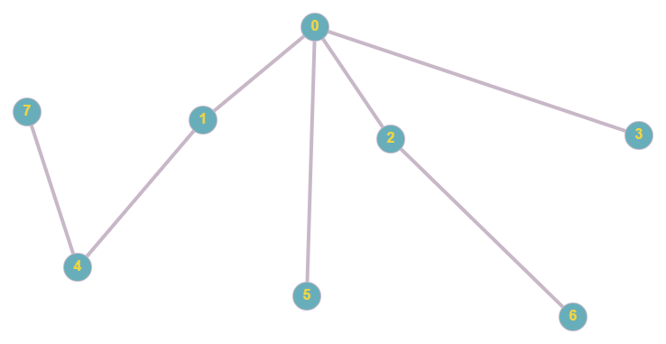
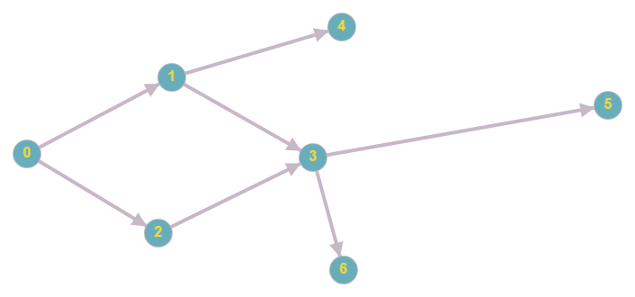
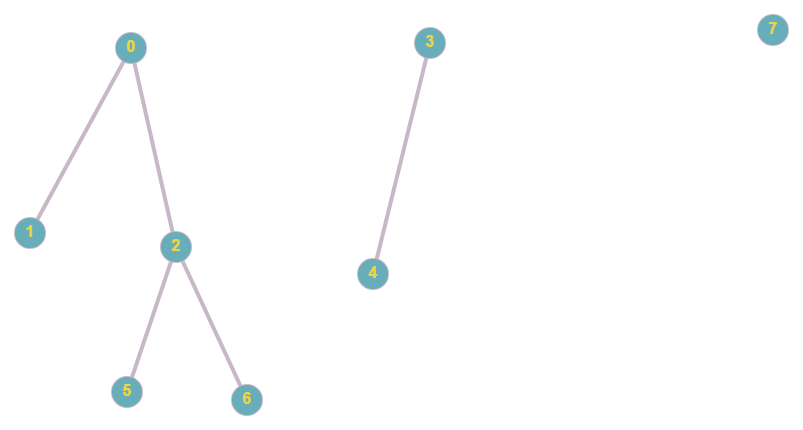

Java Community Dnepr
========

This is the project where you can train you algorithmic skills in:
- bfs (Breadth first search)
- dfs (Depth first search)
- djus (DisJoint Union of Sets)

Test cases are created for:
-  
- 
- 
- 
- 
- 
- 
- 
- 

Check out and code branch: `master`

Solution branch: `solution`

Pictures was build with [this tool](https://graphonline.ru/)

